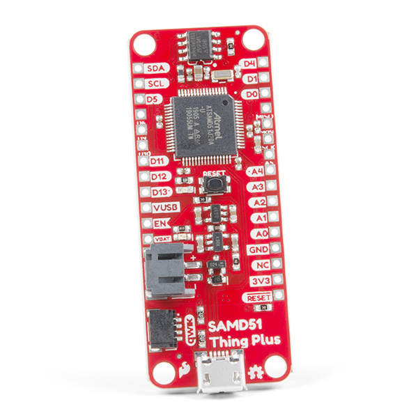

# Test Sparkfun SAMD51 Thing Plus with external I2C EEPPOM

**SparkFun Thing Plus - Hardware**
[https://www.sparkfun.com/products/14713]

- Atmel ATSAMD51J20 MCU
  - 21 Multifunctional GPIO Pins:
  - Up to six available 12-bit ADC channels
  - Up to twenty-one 24-bit PWM outputs
  - A single hardware UART
  - A single SPI Bus
  - A single I2C Bus
- Thing Plus (or Feather) Form-Factor:
  - Dimensions: 2.3" x 0.9"
  - Four Mounting Holes: 4-40 screw compatible
  - 28 PTH Pins
  - micro-B USBConnector
  - 2-pin JST Connector for a LiPo Battery (not included)
  - 4-pin JST Qwiic Connector
- LEDs:
  - CHG - Yellow battery charging indicator
  - STAT - Blue status/test LED (D13)
- Buttons:
  - Reset
  - 4Mb QSPI Flash Memory
  - SWD Pins and Test Points

## [Schematics](./doc/SAMD51_Thing_Plus_v10.pdf)

## [Graphical Datasheet](./doc/SAMD51_Thing_Plus_graphical_datasheet_v01-02.pdf)

## Some Links:

[https://github.com/sparkfun/SAMD51_Thing_Plus/pull/2]
