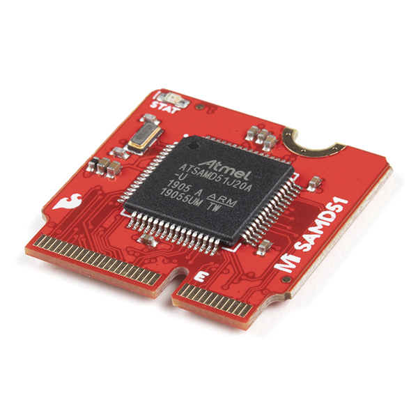
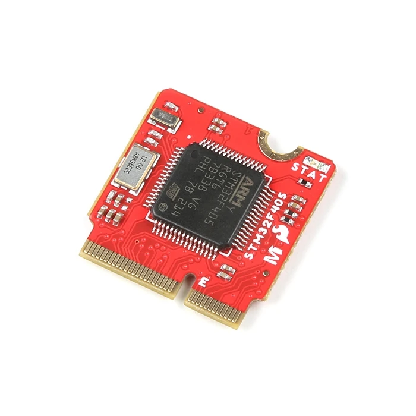
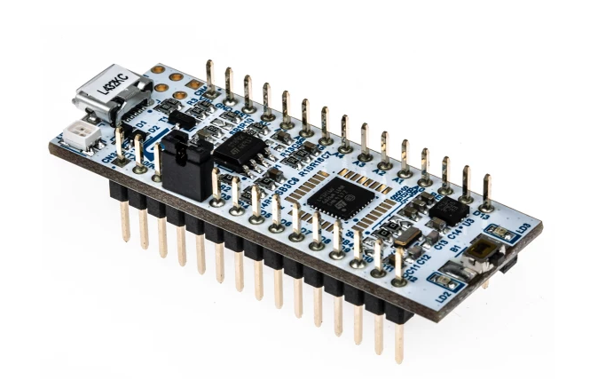
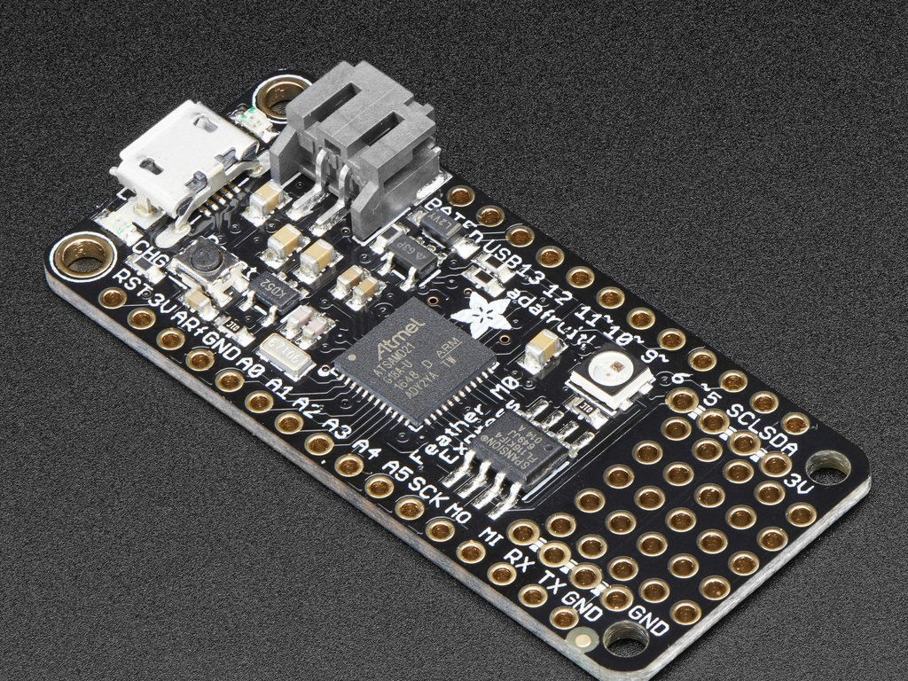
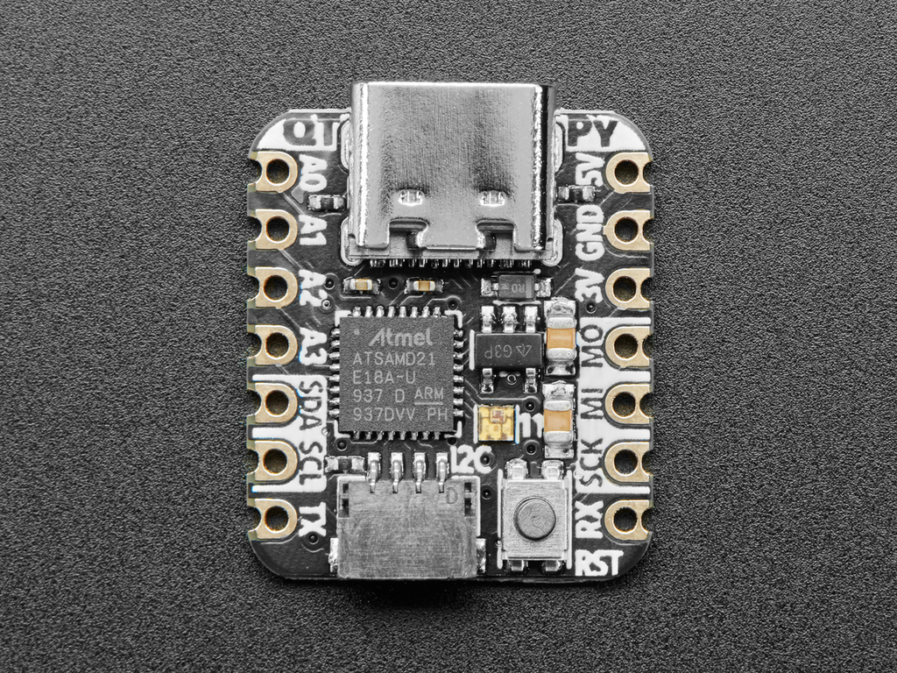
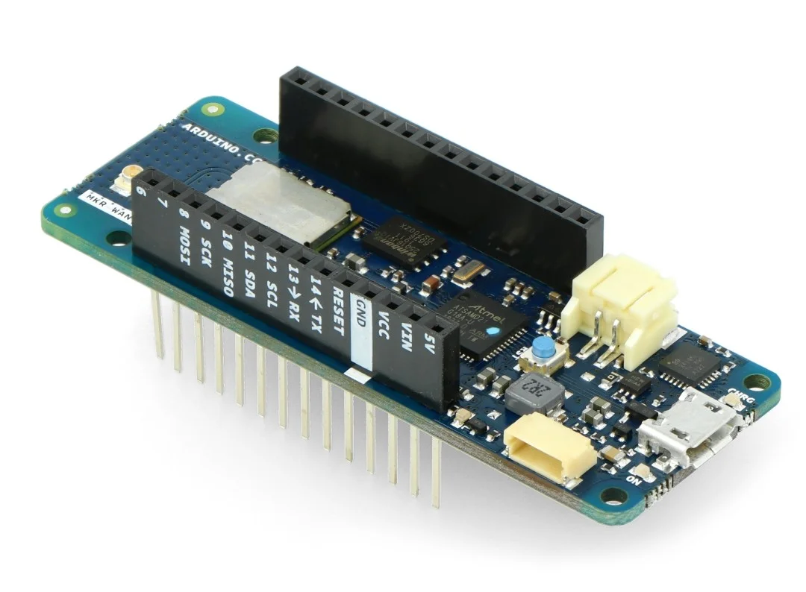

# Arduino Software for testing I2C-EEPPOM and SPI-Flash on multiple Targets

## Target: Sparkfun SAMD51 Thing Plus

**SparkFun Thing Plus - Hardware**
[https://www.sparkfun.com/products/14713]

- Atmel ATSAMD51J20 MCU
  - 32-bit ARM Cortex-M4F MCU
  - 21 Multifunctional GPIO Pins:
  - Up to six available 12-bit ADC channels
  - Up to twenty-one 24-bit PWM outputs
  - A single hardware UART
  - A single SPI Bus
  - A single I2C Bus
- Thing Plus (or Feather) Form-Factor:
  - Dimensions: 2.3" x 0.9"
  - Four Mounting Holes: 4-40 screw compatible
  - 28 PTH Pins
  - micro-B USBConnector
  - 2-pin JST Connector for a LiPo Battery (not included)
  - 4-pin JST Qwiic Connector
- LEDs:
  - CHG - Yellow battery charging indicator
  - STAT - Blue status/test LED (D13)
- Buttons:
  - Reset
  - 4Mb QSPI Flash Memory
  - SWD Pins and Test Points

### [Schematics](./doc/SAMD51_Thing_Plus_v10.pdf)

### [Graphical Datasheet](./doc/SAMD51_Thing_Plus_graphical_datasheet_v01-02.pdf)

### Some Links:

[https://github.com/sparkfun/SAMD51_Thing_Plus/pull/2]

---

## Target: SparkFun MicroMod Processor Board - SAMD51

**SparkFun MicroMod SAMD51 Processor - Hardware**
[https://www.sparkfun.com/products/16791]

- Atmel ATSAMD51J20 MCU
  - 32-bit ARM Cortex-M4F MCU
  - Up to 120MHz CPU speed
  - 1MB flash memory
  - 256KB SRAM
  - Up to 6 SERCOM interfaces
  - UF2 bootloader
- Specific Peripherals made available on MicroMod SAMD51:
  - 1x USB dedicated for programming and debug (Host capable)
  - 2x UARTs
  - 2x I2C
  - 1x SPI
  - 1x CAN
  - 11x GPIO
  - 2x Digital Pins
  - 2x Analog Pins
  - 2x PWM
  - 128mbit/16MB (external) flash memory
  - Status LED
  - VIN Level ADC

### [Schematics](https://cdn.sparkfun.com/assets/6/2/4/0/0/MicroMod_SAMD51_Schematic_v1_3.pdf)

### [Graphical Datasheet](https://cdn.sparkfun.com/assets/learn_tutorials/1/2/0/7/MicroModSAMD51ProcessorBoarda.pdf)

### Some Links:

[https://github.com/sparkfun/MicroMod_Processor_Board-SAMD51]

---

## Target: SparkFun MicroMod STM32 Processor

**SparkFun MicroMod STM32 Processor - Hardware**
[https://www.sparkfun.com/products/21326]

[https://www.sparkfun.com/sparkfun-micromod-stm32-processor.html]

- STM32F405RGT6
  - ARM® 32-bit Cortex®-M4 CPU with FPU
  - Adaptive real-time accelerator (ART Accelerator™) allowing 0-wait state execution from Flash memory
  - Frequency up to 168 MHz
  - Memory protection unit
  - 210 DMIPS/ 1.25 DMIPS/MHz (Dhrystone 2.1)
  - DSP instructions
  - 1 MB of Flash memory
  - 192 Kbytes of SRAM including 64 Kbytes of CCM (core coupled memory) data RAM
  - Flexible static memory controller supporting Compact Flash, SRAM, PSRAM, NOR and NAND memories
  - Clock, reset and supply management
  - 1.8 V to 3.6 V application supply and I/Os
  - 32 kHz oscillator for RTC with calibration
  - Internal 32 kHz RC with calibration
  - Low-power operation
  - Sleep, Stop and Standby modes
  - Debug mode
  - Serial wire debug (SWD) & JTAG interfaces
  - Cortex-M4 Embedded Trace Macrocell™
  - Advanced connectivity
  - USB 2.0 full-speed device/host/OTG controller with on-chip PHY
  - USB 2.0 high-speed/full-speed device/host/OTG controller with dedicated DMA, on-chip full-speed PHY and ULPI
  - 10/100 Ethernet MAC with dedicated DMA: supports IEEE 1588v2 hardware, MII/RMII
- Specific Peripherals available on MicroMod STM32:
  - UART (Updated in V2.0)
  - Two I2C Buses
  - SPI Bus
  - PDM Audio Processing
  - Two Dedicated Analog Inputs, 15 total analog input capable inputs
  - Two Dedicated Digital I/O Pins
  - Two Dedicated PWM Pins, 24 total PWM capable
  - Nine General Purpose I/O Pins
  - 16MB flash storage

### [Schematics](https://cdn.sparkfun.com/assets/a/d/8/c/7/21326-MicroMod_STM32_Processor-Schematic.pdf)

### [Graphical Datasheet](./doc/SAMD51_Thing_Plus_graphical_datasheet_v01-02.pdf)

### [GitHub Hardware Repo](https://github.com/sparkfun/MicroMod_STM32_Processor)

### Some Links:

[What Is MicroMod?](https://www.sparkfun.com/micromod)

---

## Target: STM32 Nucleo-32 (STM32L432KC)

https://www.st.com/en/evaluation-tools/nucleo-l432kc.html

**STM32 Nucleo-32 (STM32L432KC) - Hardware**

- [STM32L432KCU6](https://www.st.com/en/microcontrollers-microprocessors/stm32l432kc.html)

  - ARM 32-bit Cortex-M4 CPU with FPU
  - Frequency up to 80 MHz
  - 256KB Flash
  - 64KB SRAM
  - 1x 12-bit ADC 5 Msps, up to 16-bit with hardware oversampling, 200 μA/Msps
  - 2x 12-bit DAC output channels, low-power sample and hold
  - 1x operational amplifier with built-in PGA
  - 2x ultra-low-power comparators
  - 14x communication interfaces
  - USB 2.0 full-speed crystal less solution with LPM and BCD
  - 1x SAI (serial audio interface)
  - 2x I2C FM+(1 Mbit/s), SMBus/PMBus
  - 3x USARTs (ISO 7816, LIN, IrDA, modem)
  - 1x LPUART (Stop 2 wake-up)
  - 2x SPIs (and 1x Quad SPI)
  - CAN (2.0B Active)
  - SWPMI single wire protocol master I/F
  - IRTIM (Infrared interface)
  - 14-channel DMA controller
  - True random number generator
  - CRC calculation unit, 96-bit unique ID
  - 1.71 V to 3.6 V power supply
  - -40 °C to 85/105/125 °C temperature range
  - 8 nA Shutdown mode (2 wakeup pins)
  - 28 nA Standby mode (2 wakeup pins)
  - 280 nA Standby mode with RTC
  - 1.0 μA Stop 2 mode, 1.28 μA with RTC
  - 84 μA/MHz run mode
  - Batch acquisition mode (BAM)
  - 4 μs wakeup from Stop mode
  - Brown out reset (BOR)
  - Interconnect matrix
  - Adaptive real-time accelerator (ART Accelerator)

- Features
  - STM32 microcontroller in 32-pin package
  - 1 user LED
  - 1 reset push-button
  - Board connectors:Arduino™ Nano V3 expansion connectorMicro-AB USB connector for the ST-LINK
  - Flexible power-supply options: ST-LINK, USB VBUS or external sources
  - On-board ST-LINK debugger/programmer with USB re-enumeration capability: mass storage, Virtual COM port and debug port
  - Comprehensive free software libraries and examples available with the STM32Cube MCU Package
  - Support of a wide choice of Integrated Development Environments (IDEs) including IAR™, Keil® and GCC-based IDEs
- Board-specific features
  - 24 MHz crystal oscillator
  - Arm® Mbed Enabled™ compliant

---

## Target: Adafruit Feather M0 Express

https://learn.adafruit.com/adafruit-feather-m0-express-designed-for-circuit-python-circuitpython

**Adafruit Feather M0 Express - Hardware**

- [ATSAMD21G18](https://www.microchip.com/en-us/product/atsamd21g18)

  - ARM 32-bit Cortex-M0+ CPU
  - 48MHz with 3.3V logic/power
  - 256KB FLASH
  - 32KB of RAM
  - Operation Voltage 1.62V - 3.63V
  - SPI:6
  - I2C:6
  - UART:6
  - Internal Oscillator:32khz, 32Khz ULP, 8Mhz
  - Pin Count:48

- Features
  - Measures 2.0" x 0.9" x 0.28" (51mm x 23mm x 8mm) without headers soldered in
  - Light as a (large?) feather - 5 grams
  - No EEPROM
  - 32.768 KHz crystal for clock generation & RTC
  - 3.3V regulator with 500mA peak current output
  - USB native support, comes with USB bootloader and serial port debugging
  - 20 GPIO pins
  - Hardware Serial, hardware I2C, hardware SPI support
  - PWM outputs on all pins
  - 6 x 12-bit analog inputs
  - 1 x 10-bit analog ouput (DAC)
  - Built in 100mA lipoly charger with charging status indicator LED
  - Pin #13 red LED for general purpose blinking
  - Power/enable pin
  - 4 mounting holes
  - Reset button

### [Pinout](./doc/Adafruit_Feather_M0_Express_pinout.png)

### [Schematics](./doc/Adafruit_Feather_M0_Express_schematics.png)

---

## Target: Adafruit QT Py - SAMD21 Dev Board with STEMMA QT

https://learn.adafruit.com/adafruit-qt-py

https://www.adafruit.com/product/4600

**Hardware Adafruit QT Py - SAMD21 - Hardware**

- [ATSAMD21E18](https://www.microchip.com/en-us/product/atsamd21e18)

  - ARM 32-bit Cortex-M0+ CPU
  - 48MHz with 3.3V logic/power
  - 256KB FLASH
  - 32KB of RAM
  - Operation Voltage 1.62V - 3.63V
  - SPI:4
  - I2C:4
  - UART:4
  - Internal Oscillator:32khz, 32Khz ULP, 8Mhz
  - Pin Count:32

- Features
  - Same size, form-factor, and pin-out as Seeed Xiao
  - USB Type C connector
  - 11 GPIO pins:
    True analog output on one I/O pin - can be used to play 10-bit quality audio clips in Arduino (CircuitPython does not have storage for audio clips)
  - 9 x 12-bit analog inputs (SDA/SCL do not have analog inputs)
  - 1 x Optional AREF on A1
  - 9 x PWM outputs (A0 is analog out, A1 is not PWM capable)
  - Hardware I2C port with STEMMA QT plug-n-play connector
  - Hardware UART
  - Hardware SPI
  - Hardware I2S
  - 6 x Capacitive Touch with no additional components required
  - 3.3V regulator with 600mA peak output
  - Optional SOIC-8 SPI Flash chip on bottom
  - Reset switch for starting your project code over or entering bootloader mode

### [Pinout](./doc/adafruit_QTPy_pinout.png)

### [Schematics](./doc/adafruit_QTPy_sch.png)

---

## Target: Arduino MKR WAN 1310 LoRa

https://docs.arduino.cc/hardware/mkr-wan-1310/

- [ATSAMD21G18](https://www.microchip.com/en-us/product/atsamd21g18)

  - ARM 32-bit Cortex-M0+ CPU
  - 48MHz with 3.3V logic/power
  - 256KB FLASH
  - 32KB of RAM
  - Operation Voltage 1.62V - 3.63V
  - SPI:6
  - I2C:6
  - UART:6
  - Internal Oscillator:32khz, 32Khz ULP, 8Mhz
  - Pin Count:48

- Features
  - 2MByte SPI-Flash
  - Radio Modul: CMWX1ZZABZ
  - Stromversorgung (USB/VIN): 5V
    Unterstützte Batterien: wiederaufladbare Li-Ion oder Li-Po, 1024 mAh Mindestkapazität
    Digitale I/O Pins: 8
    PWM Pins: 13
    UART, SPI, I2C: je 1
    Analoge Eingangspins: 7
    Analoger Ausgangspin: 1
    Externe Interrupts: 8
    Flash-Speicher: 256 KB (intern), 2MByte (extern)
    SRAM: 32 KB
    Taktrate: 32.768 kHz (RTC), 48 MHz

### [Schematics](./doc/arduino-mkrwan1310-schematics.pdf)

### [Pinout](./doc/Arduino_MKRWAN1310-pinout.png)
